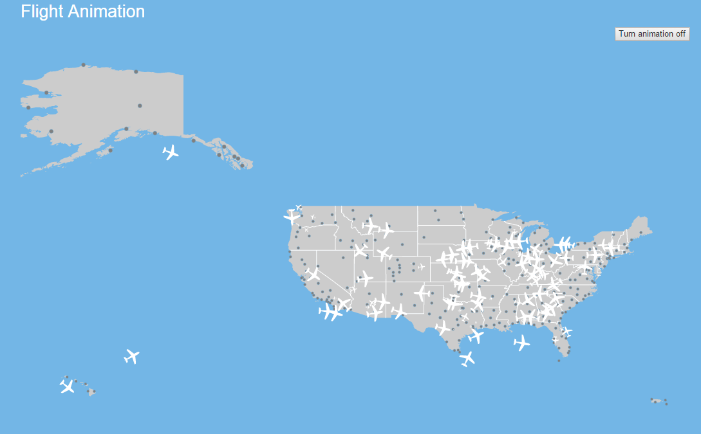
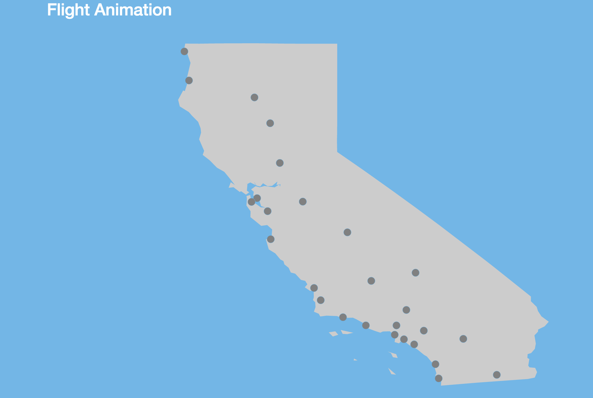
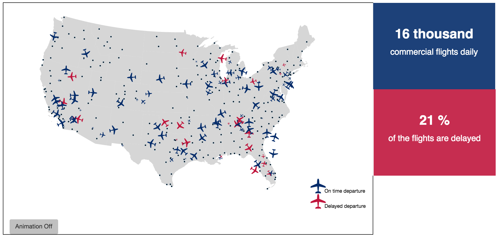

# Flight Data Visualization - Udacity Data Analysis Nanodegree

## Summary
This data set comes from the <a href="http://www.transtats.bts.gov/DL_SelectFields.asp?Table_ID=236&DB_Short_Name=On-Time">Research and Technology Bureau of Transportation Statistics</a> (RITA) and covers arrivals and departures for 2014 commercial flights in the United States. 
 
On any given day, around 16,00 commercial flights are in the skies in the United States.  About 20.5% are delayed on departure by at least 15 minutes.
 
## Design

I was most struck by the sheer volume of flight.  I learned that this data on commercial carriers only represents about 1/3 of the total volume of flights. I had no idea that there were so many flights each day.  

>"At any given moment, roughly 5,000 planes are in the skies above the United States"   - From NOAA: http://sos.noaa.gov/Datasets/dataset.php?id=44#

In my mind, the flights tell a story that is entwined with geography, so I really wanted to incorporate map data with the flight data. I combined the airline codes with latitude and longitude information which I then plotted on a map (see us_map_initial.html).  Next, I wanted to combine the geography with the sheer busyness of the skies, so I researched options for animating the flight paths (see: ./v1/first_animation.html).  I went down the path of making the states zoomable and clickable, thinking that the visualization might interact with the data on a state level, but that idea seemed to lend itself more to an exploratory visualization than an explanatory story.

All of my reviewers seemed to enjoy watching the animated flights across the US map, but through the feedback process, I realized that the animation was lacking in depth in terms of analytic value.  Therefore, I followed the suggestion of one of my reviewers and created a story around flight delays in combination with the animation and the geography.  

    
#### Animation - Initial Version   
I first represented a sample of all the United States data including Alaska, Hawaii, Virgin Islands, and Puerto Rico.  Animation showed flight movement and visually communicated flight volume, but had no additional analytic value.

<figure>
  
  <figcaption>Fig1. - Animation - including non-continguous states and territories</figcaption>
</figure>

<figure>
  
  <figcaption>Fig1.1 - Version 1 zoomed in on state </figcaption>
</figure>

#### Animation - Revised
Based on feedback recieved, I revised the animated flights with color coding in order to indicate the flights that are delayed on departure.  Also used callout boxes to highlight the numbers.
At this point, I made the decision to focus only on the continental US because animating flights in the mercator projection from Alaska or Hawaii to the contiguous states was too difficult.  Flights would appear to fly off the map.  
The equirectangular projection was more realistic, but the acurately large size of Alaska seemed like a distraction.

<figure>
    
    <figcaption>Fig2. - Animation - Continental US with on time and delayed flights differentiated
    </figcaption>
</figure>

#### Airport Delay - Two Versions
I went back and forth on this plot.  I actually started with the map,but couldn't initially figure out how to usefully differentiate the overlapping bubbles.  The overlap was especially problematic in the New York City region, as there are three major airports: Laguardia, JFK, and Newark within close proximity.  I came up with the bubble chart as a way to visually encode several different pieces of information at the same time: delay rate, average delay length, airport traffic.  However, if the x-axis begins at 0, all the data is concentrated on the right side of the graph.
<figure>
    
        <figcaption>Fig3. Airport Volume Bubble Plot
        </figcaption>
     </img>
</figure>
 

I think that I prefer this version - now that I figured out how to set the opacity and hover effects (reference: http://bost.ocks.org/mike/bubble-map/) .  In my opinion, it feels more logical (and less scrunched) to see them arranged geographically.  

<figure>
    
        <figcaption>Fig4. Airport Volume Map Plot
        </figcaption>
    </img>
</figure>

#### Delay Reasons

Added a chart visualizing delay reasons based on feedback from user: "Why don't you explain why the flights are delayed?"

#### Additional Notes

The visualization is responsive, so it scales appropriately to mobile devices.

I used glyphicon info buttons to provide additional details and definitions.  

## Feedback

**Reviewer 1:**
* Animation is mesmerizing, but of questionable analytic value.  *Suggestion:* differentiate the cancelled or delayed flights from the on time flights. 

**Reviewer 2:**
* "The airplanes move, so what?"
* The colors look very political
* "*Why* are the flights delayed?"

**Reviewer 3:**
* Colors are very patriotic.
* Easy to understand.

## Resources

* **Raw Data:** Downloaded from RITA site as 12 separate zip files.  Extracted zip files to csv files and combined them into a single pandas dataframe. 

* **US Map:** Downloaded US shape file from: https://www.census.gov/geo/maps-data/data/cbf/cbf_nation.html.  

* **Airports:** Downloaded airport city, latitute, and longitude data from: http://www.openflights.org/data.html and http://openflights.org/html/apsearch

**Javascript packages**
* bootstrap
* d3
* jquery (required for bootstrap)
* queue
* topojson
* d3.tip

**References**
* Flight animation in d3, including svg path for airplane: http://www.tnoda.com/blog/2014-04-02
* NOAA: http://sos.noaa.gov/Datasets/dataset.php?id=44#
* Bubble map: http://bost.ocks.org/mike/bubble-map/
* Map projections: https://github.com/mbostock/d3/wiki/Geo-Projections
* D3 axis labels: http://bl.ocks.org/phoebebright/3061203
* Using images as tickmarks: http://stackoverflow.com/questions/24763498/d3-js-using-images-with-filenames-specified-in-data-as-tick-values-on-axis
* Barchart reference: http://bost.ocks.org/mike/bar/3/
* Tooltips: http://bl.ocks.org/Caged/6476579
* RITA delay categories: http://www.rita.dot.gov/bts/help/aviation/html/understanding.html

**Visualization Iterations**
**all files in repo root.
* index.html is the final version
* us_map_initial.html is the first attempt at showing airports on a map
* airplane_with_flight_path.html is the first attempt at an svg airplane and flight path
* airport_delay_rate_circles.html is a bubble chart plot of the airport volume and delay rate
* airport_delay_rate_bars.html is a bar chart attempt at showing airport volume and delay rate
* delay_causes.html is a first attempt at showing the causes of delay 
* us_map_continental is a us map of the 50 contiguous states